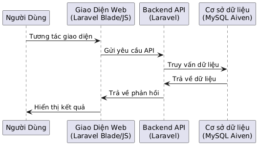

# Hệ Thống Quản Lý Trường Học

## 1. Giới Thiệu
Dự án **School Management System** được xây dựng bằng PHP Laravel và sử dụng MySQL từ Aiven để quản lý thông tin học sinh, giáo viên, khóa học và các hoạt động trong trường học.

## 2. Công Nghệ Sử Dụng
- **Laravel**: Framework PHP phổ biến để xây dựng ứng dụng web.
- **MySQL từ Aiven**: Dịch vụ cơ sở dữ liệu cloud giúp quản lý dữ liệu linh hoạt và hiệu quả.
- **Composer**: Công cụ quản lý các gói PHP.
- **Nginx/Apache** (tùy chọn): Máy chủ web.

## 3. Hướng Dẫn Cài Đặt
### 3.1. Clone Dự Án
```sh
git clone https://github.com/ka31504/webnc.git
cd qlyth
```

### 3.2. Cài Đặt Dependencies
```sh
composer install
```

### 3.3. Cấu Hình Môi Trường
Tạo file `.env` bằng cách sao chép từ `.env.example`:
```sh
cp .env.example .env
```
Cập nhật thông tin kết nối MySQL trong file `.env`:
```
DB_CONNECTION=mysql
DB_HOST=<AIVEN_HOST>
DB_PORT=3306
DB_DATABASE=<AIVEN_DATABASE>
DB_USERNAME=<AIVEN_USERNAME>
DB_PASSWORD=<AIVEN_PASSWORD>
```

### 3.4. Tạo Khóa Ứng Dụng
```sh
php artisan key:generate
```

### 3.5. Chạy Migration & Seed Database
```sh
php artisan migrate --seed
```

### 3.6. Khởi Chạy Server
```sh
php artisan serve
```
Mở trình duyệt và truy cập `http://127.0.0.1:8000`

## 4. Kiến Trúc Hệ Thống
Dưới đây là sơ đồ mô tả kiến trúc tổng quan của hệ thống:




